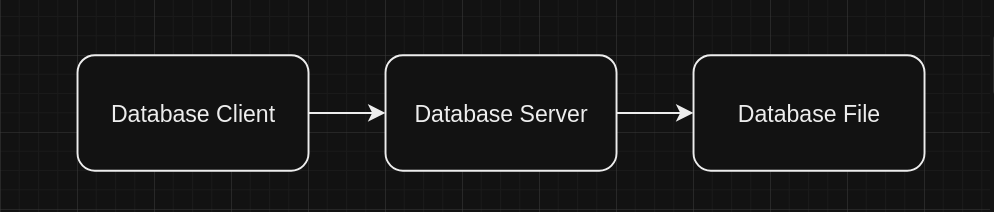
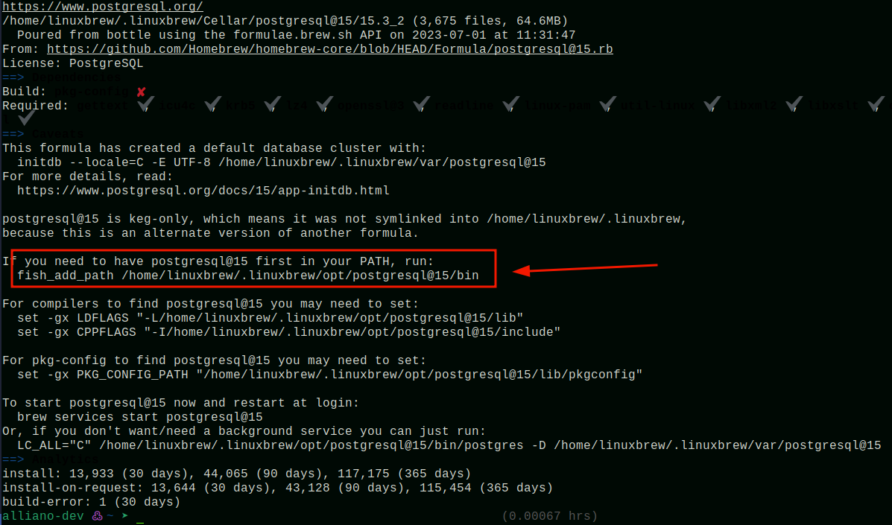
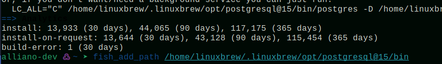
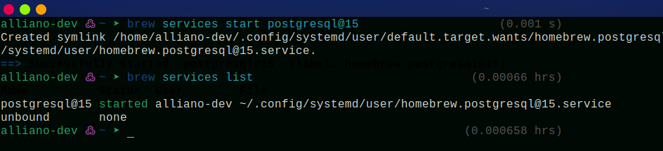

# Pengenalan DBMS
DBMS merupakan applikasi yang digunakan untuk menejemen basis data
DBMS berjalan di sisi server, dan untuk mengoprasikannya kita bisasanya membutuhkkan database client.
Database Client berfungsi untuk melakukan operasi pada server DBMS misalnya seperti :
* Memasukan data
* Menghapus data
* Mengubah data 
* Dan sebagainya  
  
Ada banyak sekali applikasi DBMS yang sangat populer salah satunya yaitu PostgreSql

# Relational Database
Ada banyak sekali jenis-jenis database misalnya seperti :
* key-value data base 
* Relational Database
* Document Database
* dan sebagainya
  
Pada Kali ini kita akan membahas Relational Database(RDBMS)
Penggunaan Relational Database cukup mudah, karena pada RDBMS kita akan menyimpan data pada tabel(kolom dan baris) mirip seperti Spred Sheet atau Excel.
Dan juga RDBMS itu memiliki perintah yang telah terstandarisas yaitu perintah SQL, sehingga jikalau kita ingin ganti DBMS(Mysql, PostgresSql, Oracle, dll) itu sangatlah mudah, karena perintah nya atau penggunaanya secara garis besar sama.

# Diagram Alur Kerja DBMS
  
Applikasi Database itu berbasis client server, Maksudnya untuk mengoprasikan database kita membutuhkan beberapa komponen, berikut ini beberapa komponen beserta fungsinya:
* **Client Database**  
  Digunakan untuk mengirimkan perintah-perintah sql kepada Database Server
* **Server Database**  
  Menerima perntah SQL dari Database client dan melakukan operasi SQL berdasarkan perintah yang dikirimkan oleh Database Client
* **File Database**  
  Menyimpan Data-data dari database

**NOTE :**
> File database tidak bisa dibaca secara langsung karena telah terenkripsi dan di desain sedemikian rupa untuk penyimpanan database

# Database Client
Database Client merupakan Applikasi atau Software yang digunakan untuk berkomunikasi dengan Database Server.  
Saat kita menginstall RDBMS biasanya kita juga akan diberikan Database Client, namun berbasis terminal atau command prompt.  
Kita juga dapat membuat Applikasi untuk berkomunikasi dengan database Server nya.

# SQL
SQL merupakan kepanjangan dari Structurd Query Language
. Bahasa yang digunakan unutuk mengirim perintah ke database server misalnya seperti perntah menyimpan, mengubahm menghapus dan sebagainya.  
SQL mudah dipelajari karna hanya berisi perntah :
* memasukan (INSERT)
* mengubah (UPDATE)
* menghapus (DELETE)
* mengambil data (SELECT)  

Perintah SQL pada RDBMS itu hampil sama, hanya saja biasanya tiap-tiap RDBMS biasanya memiliki improvement tertentu, namun secara garis besar perintah nya sama.

# Postgresql
PostgreSql merupakan salahsatu applikasi RDBMS yang populer, terutama di kalangan perusahaan sekala Enterprise.
PostgreSql ini bersifat opensource, dan juga gratis.
http://www.postgresql.org/

# Installation
PostgreSql dapat dijalankan di berbagai sistem operasi mau itu Windows, Linux, Mac.  
Dan juga kita bisa memanfaatkan docker atau docker compose untuk installasi postgreSql.
Dalam pembahasan kali ini saya akan memperaktekan instalasi pada sistem operasi Linux/Mac, Windows, dan juga instalasi menggunakan Docker atau docker-compose.  

## Installation LINUX/MAC
Untuk instalasi Postgresql pada sistem operasi mac atau linux, kita bisa memanfaatkan homebrew atau package manager di masing-masing Distro linux yang digunakan :

home brew
``` sh
brew install postgresql@15
```
Setelah itu jalankan peritah berikut ini :
``` sh
brew info postgresql@15
```
Setelah menjalankan perintah tersebut, perhatikan perintah berikut ini :

Kita bisa copy dan paste printah tersebut ke terminal untuk men seting path postgresql nya :  



Untk menjalankan porgresql yang kita install menggunakan homebrew, kita bisa menggunakan perintah berikut ini :  
``` sh
brew service start postgresql@15
```
Untuk memasitkan postgreSql kita telah berjalan, kita dapat jalankan perintah berikut ini :  
``` java
brew services list
```



# Installation dengan Docker
Kita juga bisa memanfaatkan docker untuk instalasi postgresql, sebelum melakukan instalasinya pastikan di komputer teman-teman telah terinstall docker.  
Jika sudah terinstall maka jalankan perintah berikut ini untuk mendownload image postgresql :
``` sh
docker pull postgresql:latest
```
Lalu jalankan perintah berikut ini untuk membuat volume untuk menyimpan data-data postgresql :
``` sh
docker volume create postgresql
```
Setelah itu, jalankan perintah berikut ini untuk membuat container postgresql :
``` sh
docker container create --name postgres --publish 5432:5432 --mount="type=volume, source=postgresql, destination=/var/lib/postgresql/data" --env POSTGRES_PASSWORD="azahra21" --env POSTGRES_USER="alliano-dev" postgres:latest
```

> untuk password dan user nya kalian bisa sesuaikan dengan keinginan kalian

Untuk menjalankan containe postgreSql yang barusaja dibuat jalankan perintah berikut ini :

``` sh
docker container start postgres
```

## Installation Dengan Docker Compose
Untuk melakukan instalasi postgresql menggunakan docker compose, pastikan docker, dan docker-compose telah terinstal pada komputer teman-teman.  
Untuk melakukan instalasinya, buatlah file dengan nama `docker-compose.yml`
setelah itu masukan konfigurasi yaml berikut ini pada file `docker-compose.yaml`:
``` yaml
version: '1.9'
services:
  postgresql:
    image: postgres:latest
    ports:
      - 5432:5432
    environment:
      - POSTGRES_PASSWORD=azahra21
      - POSTGRES_USER=alliano-dev
    volumes:
      - pg_volume:/var/lib/postgresql/data
volumes:
  pg_volume : {}
```
> untuk user dan password nya kalian bisa sesuaikan dengan keinginan kalian

Untuk menjalankan konfigurasi yaml kita, jalankan perintah berikut ini :
``` sh
docker compose -f docker-compose.yaml up -d
```

